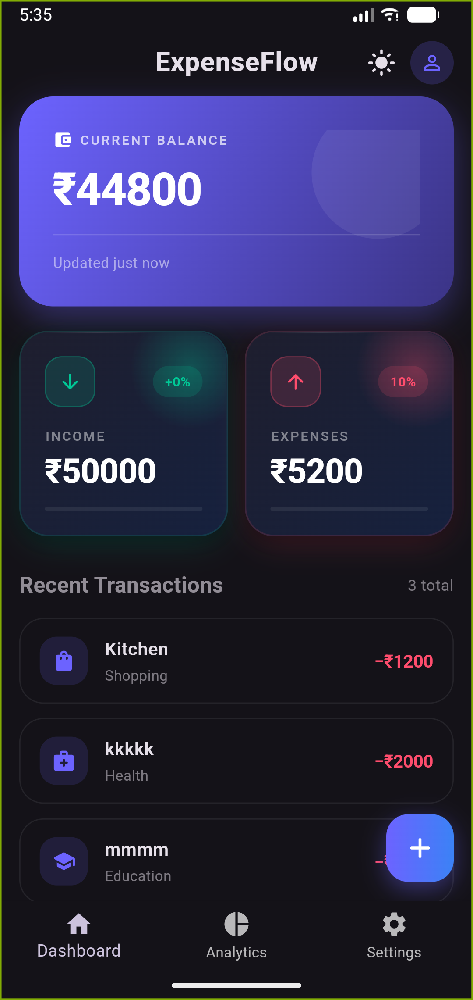
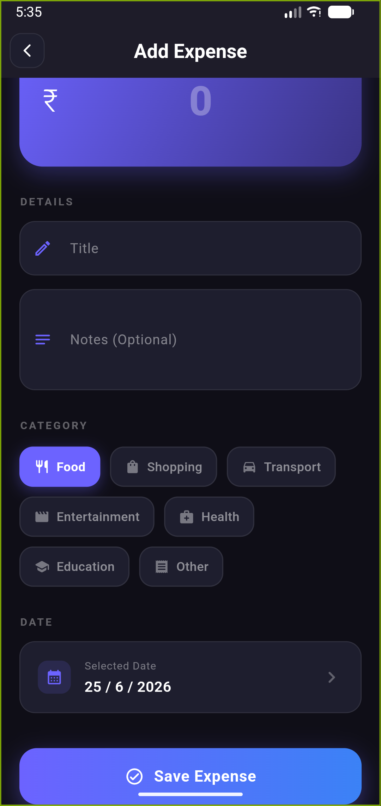
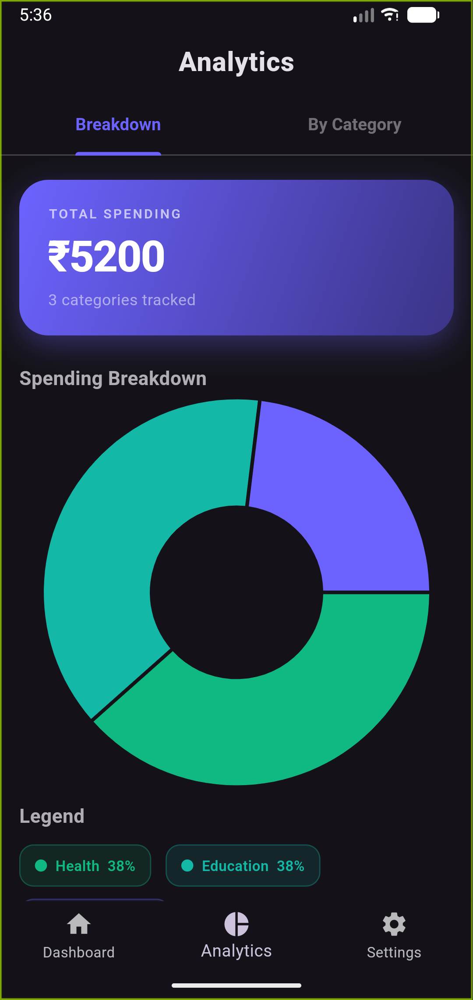
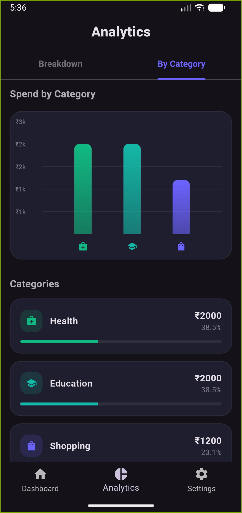

# expense_tracker

A new Flutter project.
## Screenshots

<p align="center">
  
  
</p>

<p align="center">
  
  
</p>

<!-- Add your application screenshots here -->

## Architecture Flow

```text
                         EXPENSE TRACKER
                               │
              ┌────────────────┴────────────────┐
              │                                 │
        Firebase Auth                      Firestore
              │                                 │
        ┌─────┴─────┐                    ┌─────┴─────┐
        │           │                    │           │
     Register      Login                CRUD       Queries
        │           │                    │           │
        └─────┬─────┘                    │           │
              │                          │      ┌────┴──────────────┐
              │                          │      │                   │
       currentUser.uid                   │   Monthly          Category
              │                          │   Expenses          Filtering
              │                          │
              └──────────────┬───────────┘
                             │
                         Provider
                             │
                             ▼
                            UI
```

## Architecture

* **Firebase Authentication** handles user registration, login, authentication state, and user identity.
* **Cloud Firestore** stores user-specific expenses and provides CRUD and query operations.
* **Provider** manages application state and keeps the UI synchronized with the data.
* **Repository** handles communication between the Provider and Firestore.
* **UI** displays expenses, totals, balances, and other user information.

## Data Flow

```text
User Action
    │
    ▼
     UI
    │
    ▼
ExpenseProvider
    │
    ▼
ExpenseRepository
    │
    ▼
Cloud Firestore
    │
    ▼
ExpenseProvider
    │
    ▼
notifyListeners()
    │
    ▼
     UI
```

## Firebase Structure

```text
users
 └── {uid}
      ├── name
      ├── email
      ├── createdAt
      │
      └── expenses
           ├── {expenseId}
           │    ├── title
           │    ├── amount
           │    ├── category
           │    ├── note
           │    ├── date
           │    └── createdAt
           │
           └── {expenseId}
```

## Tech Stack

* Flutter
* Dart
* Firebase Authentication
* Cloud Firestore
* Provider
* Hive
* Material UI

## Features

* User registration and login
* Persistent authentication
* Add expenses
* View expenses
* Delete expenses
* Expense totals
* Balance calculation
* Category-based organization
* Firestore cloud storage
* Loading and error states

## Getting Started

For help getting started with Flutter development, visit the
[Flutter documentation](https://docs.flutter.dev/).
